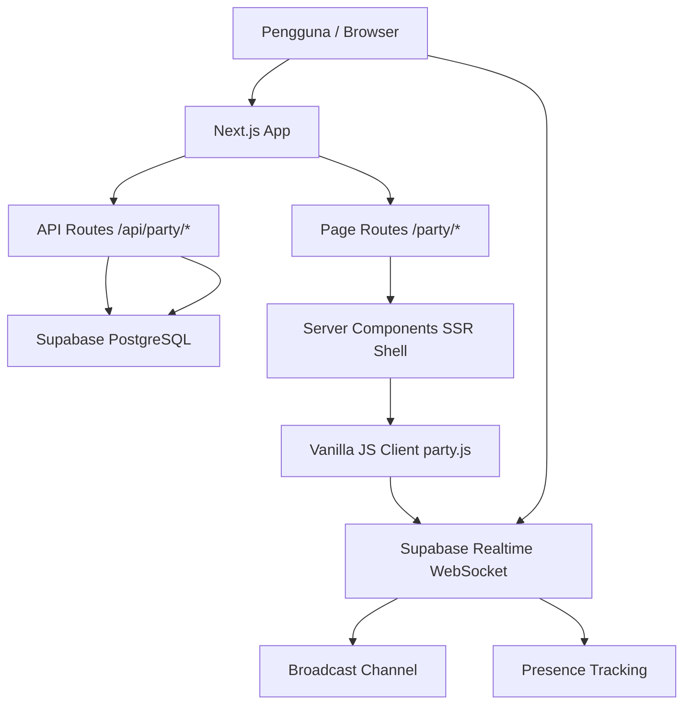
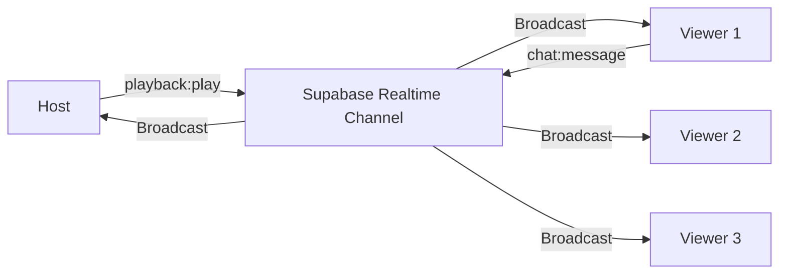
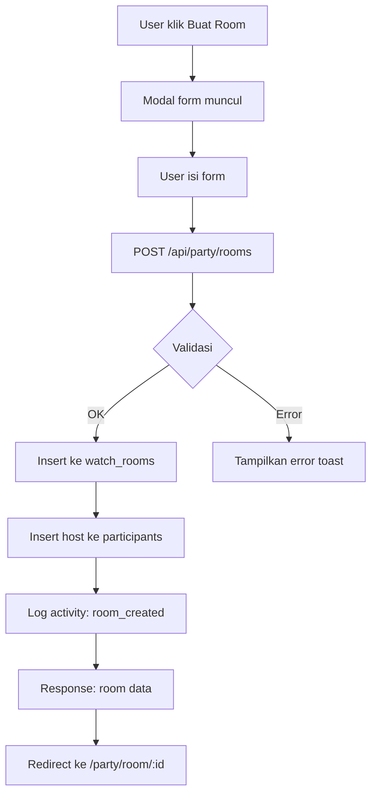
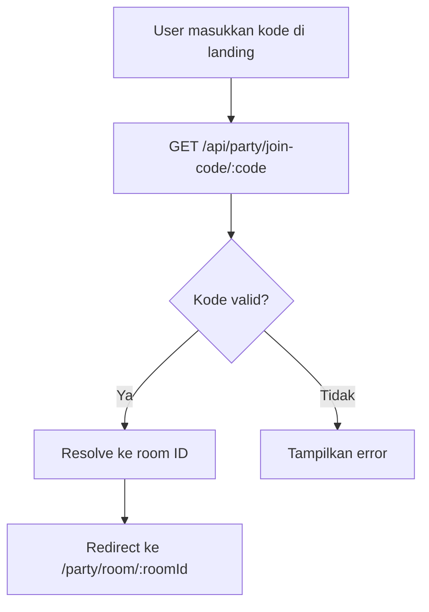
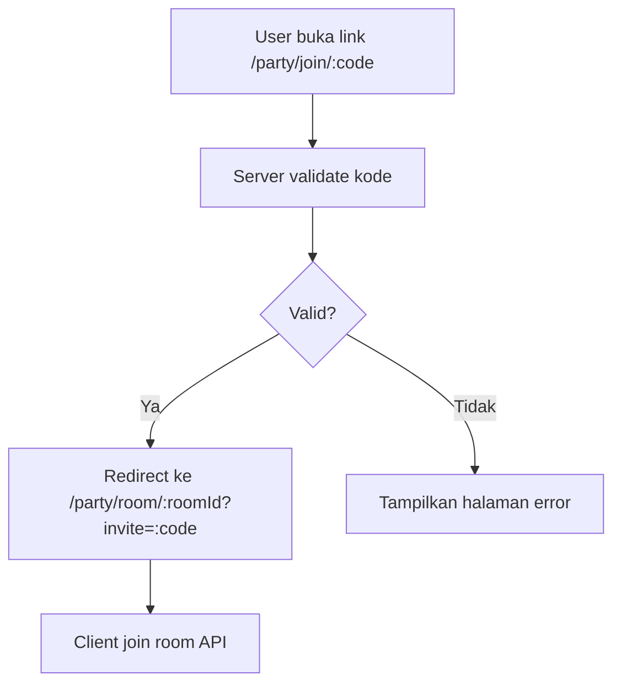

# Watch Party (Nonton Bareng) — Dokumentasi Fitur

## Daftar Isi

- [Ikhtisar](#ikhtisar)
- [Arsitektur](#arsitektur)
- [Database Schema](#database-schema)
- [Alur Pembuatan Room](#alur-pembuatan-room)
- [Alur Bergabung ke Room](#alur-bergabung-ke-room)
- [Sinkronisasi Playback](#sinkronisasi-playback)
- [Sistem Chat](#sistem-chat)
- [Sistem Permission](#sistem-permission)
- [Daftar API Endpoint](#daftar-api-endpoint)
- [Daftar Event Realtime](#daftar-event-realtime)
- [Keamanan](#keamanan)
- [Deployment](#deployment)
- [Troubleshooting](#troubleshooting)

---

## Ikhtisar

**Watch Party** (Nonton Bareng) adalah fitur premium Dramova yang memungkinkan pengguna menonton film atau serial bersama pengguna lain secara real-time. Fitur ini menyediakan:

- **Room-based viewing**: Host membuat room dengan kode unik yang dapat dibagikan
- **Playback sinkron**: Semua peserta menonton di posisi yang sama secara real-time
- **Text chat**: Komunikasi antar peserta selama sesi menonton
- **Host control**: Host mengatur playback (play, pause, seek, ganti episode)
- **Invite system**: Kode room dan link undangan yang shareable

### Teknologi yang Digunakan

| Komponen | Teknologi | Alasan |
|---|---|---|
| Frontend shell | Next.js 15 App Router | SSR, routing, API proxy |
| Client interactivity | Vanilla JavaScript | Bundle kecil, tanpa React overhead |
| Database | Supabase PostgreSQL | Sudah terintegrasi, RLS bawaan |
| Realtime | Supabase Realtime (Broadcast + Presence) | WebSocket terintegrasi, low-latency |
| Video playback | HLS.js | Sudah digunakan di Dramova |
| Styling | Tailwind CSS + custom CSS | Konsisten dengan tema Dramova |

---

## Arsitektur



### Diagram Alur Data



### Komponen Arsitektur

1. **Next.js API Routes** — CRUD room, join/leave, permission check
2. **Supabase Realtime Broadcast** — Event sinkronisasi playback dan chat (ephemeral, tidak disimpan di DB)
3. **Supabase Realtime Presence** — Tracking peserta online
4. **Supabase PostgreSQL** — Persistensi room, peserta, undangan, activity log
5. **Vanilla JS Client** — Engine sinkronisasi, UI interaktif

---

## Database Schema

### Tabel `watch_rooms`

| Kolom | Tipe | Keterangan |
|---|---|---|
| `id` | UUID (PK) | ID unik room |
| `code` | TEXT (unique) | Kode room 6 karakter, auto-generated |
| `host_id` | UUID (FK auth.users) | ID pengguna host |
| `title` | TEXT | Judul room (maks 120 karakter) |
| `content_type` | TEXT | 'shorts', 'series', atau 'movie' |
| `platform` | TEXT | Platform konten (kdrama, cdrama, dll) |
| `content_id` | TEXT | ID konten dari backend |
| `content_title` | TEXT | Judul konten (cache) |
| `current_episode` | INTEGER | Episode yang sedang diputar |
| `playback_state` | JSONB | State playback {status, currentTime, episode} |
| `max_participants` | INTEGER | Maks peserta (2-100, default 20) |
| `is_private` | BOOLEAN | Room privat (perlu kode undangan) |
| `is_active` | BOOLEAN | Room aktif atau sudah ditutup |
| `settings` | JSONB | Pengaturan room {allowSeek, allowPause, dll} |
| `created_at` | TIMESTAMPTZ | Waktu pembuatan |
| `updated_at` | TIMESTAMPTZ | Waktu update terakhir |
| `expires_at` | TIMESTAMPTZ | Waktu kedaluwarsa room |

### Tabel `watch_room_participants`

| Kolom | Tipe | Keterangan |
|---|---|---|
| `id` | UUID (PK) | ID unik peserta |
| `room_id` | UUID (FK watch_rooms) | ID room |
| `user_id` | UUID (FK auth.users) | ID pengguna |
| `display_name` | TEXT | Nama tampilan |
| `avatar_url` | TEXT | URL avatar |
| `role` | TEXT | 'host', 'moderator', atau 'viewer' |
| `status` | TEXT | 'active', 'paused', 'buffering', 'disconnected' |
| `last_heartbeat_at` | TIMESTAMPTZ | Heartbeat terakhir |
| `joined_at` | TIMESTAMPTZ | Waktu bergabung |

**Unique constraint**: `(room_id, user_id)` — satu pengguna = satu slot per room.

### Tabel `watch_room_invitations`

| Kolom | Tipe | Keterangan |
|---|---|---|
| `id` | UUID (PK) | ID unik undangan |
| `room_id` | UUID (FK watch_rooms) | ID room |
| `invited_by` | UUID (FK auth.users) | Pembuat undangan |
| `code` | TEXT (unique) | Kode undangan 8 karakter |
| `max_uses` | INTEGER | Maks penggunaan (0 = unlimited) |
| `used_count` | INTEGER | Jumlah penggunaan saat ini |
| `expires_at` | TIMESTAMPTZ | Waktu kedaluwarsa |
| `is_active` | BOOLEAN | Masih aktif |

### Tabel `watch_room_activity_log`

| Kolom | Tipe | Keterangan |
|---|---|---|
| `id` | UUID (PK) | ID unik log |
| `room_id` | UUID (FK watch_rooms) | ID room |
| `user_id` | UUID (FK auth.users) | Pelaku aksi |
| `action` | TEXT | Jenis aksi (join, leave, play, pause, dll) |
| `metadata` | JSONB | Data tambahan |
| `created_at` | TIMESTAMPTZ | Waktu aksi |

### Data yang Disimpan di Database vs Realtime

| Data | Penyimpanan | Alasan |
|---|---|---|
| Room metadata | Database | Perlu persistensi dan query |
| Participant list | Database + Presence | DB sebagai sumber kebenaran, Presence untuk real-time status |
| Playback state | Database (snapshot) + Broadcast (realtime) | DB untuk late joiners, Broadcast untuk sync |
| Chat messages | **Hanya Broadcast (ephemeral)** | Chat tidak perlu disimpan, menghemat storage |
| Activity log | Database | Audit trail |
| Invitations | Database | Perlu tracking penggunaan |

---

## Alur Pembuatan Room



### Langkah Detail

1. Pengguna mengakses halaman `/party`
2. Klik "Buat Room", isi form (judul, tipe konten, platform, ID konten)
3. Frontend mengirim `POST /api/party/rooms` dengan payload
4. Server membuat room dengan kode unik (6 karakter) menggunakan `generate_room_code()`
5. Server meng-insert host sebagai peserta pertama dengan role `host`
6. Server mencatat activity log
7. Response mengembalikan data room
8. Frontend redirect ke halaman room `/party/room/:roomId`

---

## Alur Bergabung ke Room

### Via Kode Room (6 karakter)



### Via Link Undangan (8 karakter)



### Langkah Detail di Room Page

1. Frontend memanggil `POST /api/party/rooms/:roomId/join`
2. Server validasi: room aktif, belum penuh, kode undangan valid (jika private)
3. Server insert/update peserta
4. Client subscribe ke Supabase Realtime channel `watch-room:{roomId}`
5. Client track presence dan request sync dari host
6. Video dimuat dan playback disinkronkan

---

## Sinkronisasi Playback

### Protokol Sinkronisasi

Sinkronisasi menggunakan pendekatan **host-authoritative** dengan **timestamp-based correction**:

```
Host melakukan aksi (play/pause/seek)
  → Broadcast event ke channel
  → Event berisi: { currentTime, updatedAt (server timestamp), updatedBy }
  → Semua viewer menerima event
  → Viewer menghitung targetTime = event.currentTime + (now - event.updatedAt) * rate
  → Viewer menghitung drift = |video.currentTime - targetTime|
  → Jika drift > 0.5s: koreksi playback
```

### Algoritma Drift Correction

```javascript
// 1. Hitung target position
const targetTime = event.currentTime + ((now - event.updatedAt) / 1000) * playbackRate;

// 2. Hitung drift
const drift = Math.abs(video.currentTime - targetTime);

// 3. Koreksi berdasarkan besaran drift
if (drift >= 3.0) {
  // Drift besar: langsung seek
  video.currentTime = targetTime;
} else if (drift >= 0.5) {
  // Drift kecil: adjust playback rate sementara
  const direction = targetTime > video.currentTime ? 1 : -1;
  video.playbackRate = baseRate + (direction * 0.1);
  // Kembalikan ke normal setelah beberapa detik
}
// drift < 0.5s: abaikan (dalam toleransi)
```

### Event Playback

| Event | Payload | Kapan Dikirim |
|---|---|---|
| `playback:play` | `{ currentTime, updatedAt, updatedBy }` | Host menekan play |
| `playback:pause` | `{ currentTime, updatedAt, updatedBy }` | Host menekan pause |
| `playback:seek` | `{ currentTime, updatedAt, updatedBy }` | Host melakukan seek |
| `playback:speed` | `{ rate, updatedBy }` | Host mengubah kecepatan |
| `playback:episode` | `{ episode, currentTime, updatedBy }` | Host ganti episode |
| `playback:sync-request` | `{ by }` | Viewer baru bergabung |
| `playback:sync-response` | `{ currentTime, isPlaying, episode, updatedAt }` | Host merespons sync request |

### Reconnect Handling

1. Client mendeteksi koneksi terputus (status `CHANNEL_ERROR`)
2. Exponential backoff: `delay = min(1000 * 2^attempt, 30000)` ms
3. Maks 10 percobaan reconnect
4. Setelah reconnect: kirim `playback:sync-request` untuk sinkronisasi ulang
5. Jika semua percobaan gagal: tampilkan notifikasi dan opsi keluar

### Heartbeat

- Client mengirim heartbeat setiap **10 detik** ke API
- Server dapat membersihkan peserta yang tidak heartbeat > 60 detik via `cleanup_stale_participants()`
- Presence Supabase juga otomatis mendeteksi disconnect

---

## Sistem Chat

Chat menggunakan **Supabase Realtime Broadcast** tanpa penyimpanan di database (ephemeral):

- Pesan hanya hidup selama sesi room aktif
- Maks 200 pesan ditampilkan di UI (older messages di-trim)
- Maks panjang pesan: 500 karakter
- Tidak ada persistence — setelah room ditutup, chat hilang

### Event Chat

| Event | Payload |
|---|---|
| `chat:message` | `{ id, userId, name, text, timestamp }` |

---

## Sistem Permission

### Role Peserta

| Role | Kemampuan |
|---|---|
| **Host** | Semua kontrol playback, kick peserta, ubah settings, tutup room, buat undangan |
| **Moderator** | Kick peserta (fitur future) |
| **Viewer** | Menonton, chat, tidak bisa kontrol playback |

### Room Settings

```json
{
  "allowSeek": true,
  "allowPause": true,
  "allowNextEp": true,
  "chatEnabled": true
}
```

Settings ini dapat diubah oleh host via `PATCH /api/party/rooms/:roomId`.

---

## Daftar API Endpoint

### Room Management

| Method | Endpoint | Deskripsi |
|---|---|---|
| `GET` | `/api/party/rooms` | List room aktif milik user |
| `POST` | `/api/party/rooms` | Buat room baru |
| `GET` | `/api/party/rooms/:roomId` | Detail room + peserta |
| `PATCH` | `/api/party/rooms/:roomId` | Update settings (host only) |
| `DELETE` | `/api/party/rooms/:roomId` | Tutup room (host only) |

### Room Actions

| Method | Endpoint | Deskripsi |
|---|---|---|
| `POST` | `/api/party/rooms/:roomId/join` | Bergabung ke room |
| `POST` | `/api/party/rooms/:roomId/leave` | Keluar dari room |
| `POST` | `/api/party/rooms/:roomId/kick` | Kick peserta (host/mod) |
| `GET` | `/api/party/rooms/:roomId/sync` | Get playback state (late joiner) |

### Invite

| Method | Endpoint | Deskripsi |
|---|---|---|
| `POST` | `/api/party/invite` | Buat kode undangan |
| `GET` | `/api/party/invite/:code` | Validasi kode undangan |
| `GET` | `/api/party/join-code/:code` | Resolve kode room ke room ID |

### Request/Response Examples

**POST /api/party/rooms** — Buat room

```json
// Request
{
  "title": "Nonton Crash Landing on You",
  "content_type": "series",
  "platform": "kdrama",
  "content_id": "crash-landing-on-you",
  "content_title": "Crash Landing on You",
  "current_episode": 1,
  "max_participants": 20,
  "is_private": false,
  "expires_in_hours": 24
}

// Response 201
{
  "room": {
    "id": "uuid-here",
    "code": "ABC123",
    "title": "Nonton Crash Landing on You",
    ...
  }
}
```

**POST /api/party/rooms/:roomId/join** — Gabung room

```json
// Request
{
  "invite_code": "optional-invite-code"
}

// Response 200
{
  "participant": { "id": "...", "role": "viewer", ... },
  "room": { "id": "...", "playback_state": {...}, ... }
}
```

---

## Daftar Event Realtime

Channel: `watch-room:{roomId}`

### Broadcast Events

| Event | Arah | Deskripsi |
|---|---|---|
| `playback:play` | Host → All | Host mulai playback |
| `playback:pause` | Host → All | Host pause playback |
| `playback:seek` | Host → All | Host seek ke posisi |
| `playback:speed` | Host → All | Host ubah kecepatan |
| `playback:episode` | Host → All | Host ganti episode |
| `playback:sync-request` | Any → Host | Viewer minta sync |
| `playback:sync-response` | Host → Requester | Host kirim state |
| `chat:message` | Any → All | Pesan chat |
| `room:settings` | Host → All | Settings berubah |
| `room:closed` | Host → All | Room ditutup |

### Presence

Track payload:
```json
{
  "userId": "uuid",
  "displayName": "Nama User",
  "avatarUrl": "https://...",
  "role": "host",
  "status": "active"
}
```

---

## Keamanan

### Row Level Security (RLS)

Semua tabel dilindungi RLS Supabase:

- **watch_rooms**: Hanya host yang bisa update/delete, peserta bisa read
- **watch_room_participants**: User hanya bisa insert diri sendiri, host bisa delete siapapun
- **watch_room_invitations**: Hanya host yang bisa buat dan baca undangan
- **watch_room_activity_log**: Peserta bisa read, hanya authenticated user bisa insert

### API Security

- Semua endpoint memerlukan autentikasi Supabase
- Host-only endpoints divalidasi di server (bukan di client)
- Rate limiting direkomendasikan via Supabase Edge Functions atau Cloudflare

### Input Validation

- Judul room: maks 120 karakter
- Kode room: auto-generated, 6 karakter alphanumeric (tanpa karakter ambigu: 0, O, I, 1)
- Kode undangan: 8 karakter alphanumeric
- Chat message: maks 500 karakter
- Content ID: maks 300 karakter

### Best Practices

1. Jangan pernah trust client-side permission checks
2. Selalu validasi host_id di server untuk operasi sensitif
3. Gunakan `SUPABASE_SERVICE_ROLE_KEY` hanya di server (API routes)
4. Aktifkan `pgcrypto` extension untuk UUID generation

---

## Deployment

### Langkah Deployment

1. **Jalankan Migration SQL**
   - Buka Supabase Dashboard → SQL Editor
   - Copy-paste isi file `docs/migrations/watch_party.sql`
   - Klik Run

2. **Aktifkan Realtime**
   - Supabase Dashboard → Database → Replication
   - Pastikan tabel `watch_rooms` dan `watch_room_participants` sudah ter-publish

3. **Enable Realtime Broadcast**
   - Secara default, Supabase Realtime mendukung Broadcast tanpa konfigurasi tambahan
   - Channel `watch-room:{roomId}` akan otomatis tersedia

4. **Environment Variables** (jika diperlukan)
   - `NEXT_PUBLIC_SUPABASE_URL` — sudah ada
   - `NEXT_PUBLIC_SUPABASE_ANON_KEY` — sudah ada
   - `SUPABASE_SERVICE_ROLE_KEY` — sudah ada

5. **Cleanup Cron** (opsional)
   - Setup Supabase Edge Function atau pg_cron untuk menjalankan:
     - `cleanup_expired_rooms()` — setiap jam
     - `cleanup_stale_participants()` — setiap 5 menit

### File yang Perlu Di-deploy

```
src/
  app/party/*                    — Page routes
  app/api/party/*                — API routes
  components/party/*             — SSR components
  lib/party.ts                   — Server-side service
public/
  js/party.js                    — Client-side party controller
  js/party-landing.js            — Landing page JS
  css/party.css                  — Party styles
```

---

## Troubleshooting

### Room tidak bisa dibuat

**Gejala**: Error "Gagal membuat room"

**Solusi**:
- Pastikan migration SQL sudah dijalankan
- Cek RLS policy `create_rooms` aktif
- Cek Supabase connection di browser console

### Peserta tidak bisa join

**Gejala**: "Room tidak ditemukan atau sudah ditutup"

**Solusi**:
- Pastikan room `is_active = true`
- Cek room belum mencapai `max_participants`
- Jika room private, pastikan kode undangan valid

### Playback tidak sinkron

**Gejala**: Video antar peserta di posisi berbeda

**Solusi**:
- Cek koneksi WebSocket (status indicator harus hijau)
- Host klik "Sinkron Semua" di panel host
- Viewer refresh halaman jika stuck
- Cek browser console untuk error Supabase Realtime

### Chat tidak muncul

**Gejala**: Pesan tidak terkirim atau tidak diterima

**Solusi**:
- Pastikan room settings `chatEnabled = true`
- Cek koneksi Realtime (harus SUBSCRIBED)
- Cek browser console untuk error broadcast

### Koneksi sering terputus

**Gejala**: Status berubah ke "Menghubungkan..." terus-menerus

**Solusi**:
- Cek koneksi internet
- Cek firewall tidak blocking WebSocket
- Supabase Realtime URL harus accessible
- Cek Supabase Dashboard → Logs untuk error

### Room otomatis tertutup

**Gejala**: Room tidak aktif setelah beberapa waktu

**Solusi**:
- Room memiliki `expires_at` (default 24 jam)
- Buat room baru atau perpanjang `expires_at` via PATCH API
- Jalankan `cleanup_expired_rooms()` jika room tidak muncul di list

---

## Struktur File

```
docs/
  migrations/
    watch_party.sql           # Migration SQL lengkap
  room.md                     # Dokumentasi ini

src/
  app/
    party/
      page.tsx                # Landing: Nonton Bareng
      join/[code]/page.tsx    # Join redirect page
      room/[roomId]/page.tsx  # Watch party room page
    api/party/
      rooms/
        route.ts              # GET list, POST create
        [roomId]/
          route.ts            # GET/PATCH/DELETE room
          join/route.ts       # POST join
          leave/route.ts      # POST leave
          kick/route.ts       # POST kick
          sync/route.ts       # GET sync state
      invite/
        route.ts              # POST create invite
        [code]/route.ts       # GET validate invite
      join-code/
        [code]/route.ts       # GET resolve room code
  components/party/
    PartyLanding.tsx          # Landing page SSR shell
    PartyRoomView.tsx         # Room view SSR shell
  lib/
    party.ts                  # Server-side party service layer

public/
  js/
    party.js                  # Client-side party controller (1140 baris)
    party-landing.js          # Landing page interactions (286 baris)
  css/
    party.css                 # Party-specific styles (1254 baris)
```
